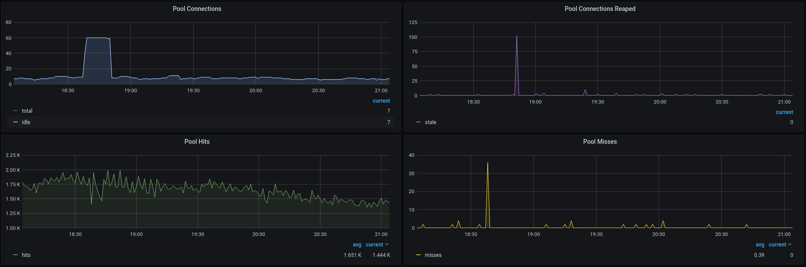

# go-pg-monitor

Provides Prometheus metrics for [go-pg](https://github.com/go-pg/pg) database client.

Example Grafana dashboards:



## Usage

0. Your application should already be using go-pg and exporting Prometheus metrics.

1. Add the module to your project:

    ```shell
    go get github.com/hypnoglow/go-pg-monitor
    ```
   
   Also add the submodule with the go-pg version you use:

    ```shell
    go get github.com/hypnoglow/go-pg-monitor/gopgv10
    ```

2. Add monitor to your application entrypoint:

    ```go
    // Create monitor based on your *pg.DB
    mon := monitor.NewMonitor(
		gopgv10.NewObserver(db),
		monitor.NewMetrics(),
	)
   
    // Call this on application startup. 
    mon.Open()
	
    // Call this on application shutdown.
    mon.Close()
    ```

See [example](example/main.go) for details.

## Exported metrics

- `go_pg_pool_hits` - (Gauge) Number of times free connection was found in the pool
- `go_pg_pool_misses` - (Gauge) Number of times free connection was NOT found in the pool
- `go_pg_pool_timeouts` - (Gauge) Number of times a wait timeout occurred
- `go_pg_pool_total_connections` - (Gauge) Number of total connections in the pool
- `go_pg_pool_idle_connections` - (Gauge) Number of idle connections in the pool
- `go_pg_pool_stale_connections` - (Gauge) Number of stale connections removed from the pool
