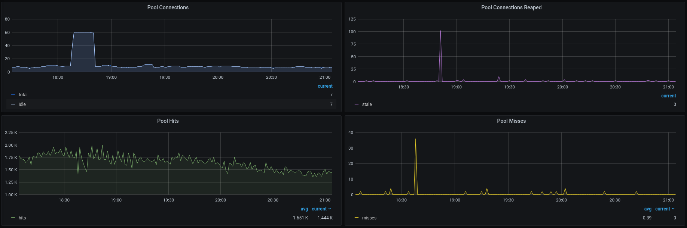

# go-pg-monitor

[](https://pkg.go.dev/github.com/hypnoglow/go-pg-monitor)
[](https://github.com/hypnoglow/go-pg-monitor)
[](https://github.com/hypnoglow/go-pg-monitor/actions/workflows/main.yml)

Provides Prometheus metrics for [go-pg](https://github.com/go-pg/pg) database client.

Example Grafana dashboards:



## Status

This package is now stable.

As the [go-pg](https://github.com/go-pg/pg) is in a maintenance mode, it is unlikely
that new features will be introduced in this package. Fixing bugs and security issues
will continue.

## Usage

0. Your application should already be using go-pg and exporting Prometheus metrics.

1. Add the module to your project:

    ```shell
    go get github.com/hypnoglow/go-pg-monitor
    ```
   
   Also add the submodule with the go-pg version you use:

    ```shell
    go get github.com/hypnoglow/go-pg-monitor/gopgv10
    ```

2. Add monitor to your application entrypoint:

    ```go
    // Create monitor based on your *pg.DB
    mon := monitor.NewMonitor(
		gopgv10.NewObserver(db),
		monitor.NewMetrics(),
	)
   
    // Call this on application startup. 
    mon.Open()
	
    // Call this on application shutdown.
    mon.Close()
    ```

See [example](example/main.go) for details.

## Exported metrics

- `go_pg_pool_hits` - (Gauge) Number of times free connection was found in the pool
- `go_pg_pool_misses` - (Gauge) Number of times free connection was NOT found in the pool
- `go_pg_pool_timeouts` - (Gauge) Number of times a wait timeout occurred
- `go_pg_pool_total_connections` - (Gauge) Number of total connections in the pool
- `go_pg_pool_idle_connections` - (Gauge) Number of idle connections in the pool
- `go_pg_pool_stale_connections` - (Gauge) Number of stale connections removed from the pool

## Reference Grafana Dashboards

You can find two example Grafana dashboards in [grafana/](grafana/) directory. 
[One](<grafana/Postgres Database Client.json>) may be suitable when you use only one database object
in your application code, and the [other](<grafana/Postgres Database Client Pools.json>) when
you use different objects (pools) for different parts of the application.

Note that your dashboard may be different if you use metric namespace, different k8s labels, etc.
So these dashboards are provided only as a starting point for making your own.
